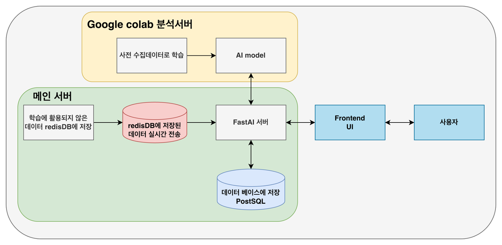

# 프로젝트 설명

전동기의 **진동 센서 데이터를 학습하여 설비 이상을 탐지하는 시스템**입니다.
센서에서 수집된 데이터를 학습 데이터 형태로 변환한 뒤 **Colab 분석 서버**로 전달하여 예측 결과를 받고, 이를 대시보드에 실시간으로 표시합니다.

---

# 데이터 출처

AI Hub – 기계시설물 고장 예지 센서 데이터
[https://www.aihub.or.kr/aihubdata/data/view.do?dataSetSn=238](https://www.aihub.or.kr/aihubdata/data/view.do?dataSetSn=238)

---

# 패키지 설치

## Python 패키지 설치

```bash
pip install -r requirements.txt
```

## 프론트엔드 패키지 설치

```bash
cd frontend
npm install
```

---

# 환경 설정

# 1. Redis 설치 및 실행

---

## 🖥 MacOS

### 🔧 설치 (Homebrew)

```bash
brew install redis
```

### ▶️ Redis 실행

```bash
brew services start redis
```

### ⏹ Redis 종료

```bash
brew services stop redis
```

### 🧪 Redis 동작 확인

```bash
redis-cli ping
# 출력: PONG
```

---

## 🪟 Windows

### 🔧 설치

1. Redis 공식 다운로드
   [https://github.com/microsoftarchive/redis/releases](https://github.com/microsoftarchive/redis/releases)
   → `Redis-x64-x.x.x.msi` 설치

2. 설치 중 “Add Redis to PATH” 체크 권장

### ▶️ Redis 실행

```bash
redis-server
```

### 🧪 Redis 동작 확인

새 터미널 열고:

```bash
redis-cli ping
```

### 🚀 Windows 서비스를 통한 자동 실행 설정

관리자 CMD에서:

```cmd
sc config Redis start= auto
```

---

# 2. PostgreSQL 설치 및 실행

---

## 🖥 MacOS

### 🔧 설치

```bash
brew install postgresql
```

또는 특정 버전 명시:

```bash
brew install postgresql@14
```

### ▶️ 자동 실행

```bash
brew services start postgresql
```

### 📌 실행 서비스 확인

```bash
brew services list
```

### 🧹 (선택) 초기화

```bash
initdb /opt/homebrew/var/postgresql@14/data
```

### 🗄 DB 접속

```bash
psql -d postgres
```

### 👤 슈퍼유저 계정 생성

```bash
createuser -s postgres
```

### 📁 PATH 등록

```bash
echo 'export PATH="/opt/homebrew/opt/postgresql@16/bin:$PATH"' >> ~/.zshrc
source ~/.zshrc
```

---

## 🪟 Windows

### 🔧 설치

1. PostgreSQL 공식 설치 페이지
   [https://www.postgresql.org/download/windows/](https://www.postgresql.org/download/windows/)

2. 설치 시 포함되는 **pgAdmin**, **psql**, **PostgreSQL Server** 자동 설치됨

3. 설치 중 superuser 비밀번호 입력 → 기억 필요

### ▶️ PostgreSQL 서버 시작

설치 후 자동 실행되며, 중지/시작은 Windows 서비스에서 관리 가능

또는 명령 프롬프트에서:

```cmd
net start postgresql-x64-16
net stop postgresql-x64-16
```

### 🗄 psql 접속

```cmd
psql -U postgres -d postgres
```

설치 시 설정한 비밀번호 입력

### 👤 새로운 슈퍼유저 생성

```sql
CREATE ROLE postgres SUPERUSER LOGIN PASSWORD 'your_password';
```

---

# 실행 방법

## 1. Colab 분석 서버 실행

* Google Drive에서 `분석서버 실행파일.ipynb` 실행
경로 설정과 ngrok토큰발급 필요

---

## 2. 프론트엔드 실행 (터미널 생성)

```bash
cd frontend
npm run dev
```

---

## 3. Redis에 데이터 적재 (parquet_to_redis) (터미널 생성)

```bash
python -m backend.services.parquet_to_redis
```

---

## 4. 백엔드 서버 실행 (터미널생성)

```bash
cd backend
uvicorn main:app --reload
```
